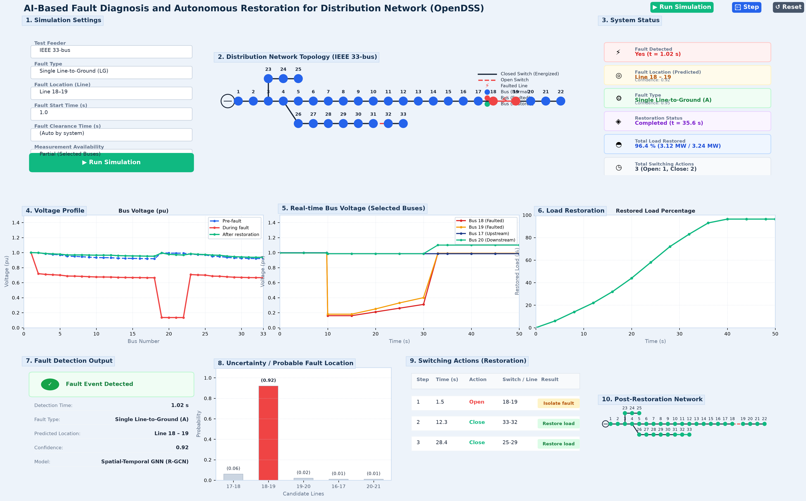

# Uncertain Grid Restoration

> **A Physics-Informed, Belief-State Reinforcement Learning Framework for Active Distribution Network Restoration under Severe Partial Observability and Sensor Failure**

[](https://www.python.org/downloads/)
[](https://pytorch.org/)
[](https://pyg.org/)
[](https://sourceforge.net/projects/electricdss/)

---

## 📌 Overview

During extreme weather events, physical component degradation, and cyber-physical disruptions, electrical power distribution networks suffer catastrophic outages requiring rapid service restoration. Conventional automated restoration techniques—such as MILP and standard RL—operate under the brittle assumption of complete, deterministic system observability. In real-world disasters, SCADA and PMU sensors fail, drop telemetry, or inject Gaussian noise. Operating deterministic decision agents under uncalibrated partial observability can cause catastrophic voltage violations, thermal overload, or destructive closed-loop switching.

**Uncertain Grid Restoration** is an end-to-end cyber-physical framework combining:
1. **Physics-Informed Graph Neural Networks (PI-GNN)**: Dual-head GATv2 architectures that estimate hidden grid states ($\hat{V}, \hat{\theta}, \hat{I}$) under up to 80% sensor dropout, trained via custom loss penalties enforcing Kirchhoff's Current Law (KCL), power balance residuals, and ANSI C84.1 voltage constraints.
2. **Bayesian Uncertainty Decomposition**: Quantifies and separates predictive variance into aleatoric (measurement noise) and epistemic (model knowledge limits) components using Gaussian Negative Log-Likelihood (NLL) and Monte Carlo (MC) Dropout.
3. **Probabilistic Fault Localization**: Secondary GNN architectures that isolate line faults using physical KCL mismatch residuals.
4. **14-Dimensional Markovian Belief Graph**: Unifies node and edge physics, estimated uncertainties, and switch statuses into a structured graph state for RL decision-making.
5. **Safe Reinforcement Learning (Graph-PPO)**: Navigates the Belief Graph to actuate sectionalizing and tie switches. A multi-stage **Safety Filter** strictly enforces topological radiality and physical voltage/thermal constraints before any action executes.
6. **Interactive Real-Time Dashboard**: High-fidelity web interface providing live visualization of grid topology, bus voltage profiles with uncertainty confidence bounds, line loadings, and step-by-step restoration sequences.

---

## 🖼️ Dashboard Preview



---

## 🏗️ Repository Architecture

```text
RM_Project/
├── dashboard.html                         # Standalone bundled interactive dashboard
├── bundle_html.py                         # Bundler to package HTML, CSS, and JS into single file
├── run_dashboard.py                       # Root shortcut to launch local dashboard server
├── PROJECT_DOCUMENT.md                    # In-depth technical specifications and research paper
├── restoration_dashboard_output.png       # Dashboard screenshot preview
│
└── uncertain_grid_restoration/            # Core framework package
    ├── dashboard/                         # Modular web dashboard assets (HTML, CSS, JS)
    │   ├── index.html
    │   ├── style.css
    │   └── app.js
    ├── data/                              # Data directories (raw, state_estimation, fault_localization, processed)
    ├── dss/                               # OpenDSS circuit benchmark definitions (IEEE-33, IEEE-69)
    ├── environment/                       # Gymnasium restoration environment with Belief Graph
    ├── evaluation/                        # Evaluation metrics and state assessment scripts
    ├── experiments/                       # Research experiment execution (Exp 1 - Exp 6)
    ├── graph/                             # Graph construction and Belief Graph assembly
    ├── models/                            # PyG neural network architectures (PI-GNN, Uncertainty GNN, Fault GNN)
    ├── safety/                            # Safety filter enforcing radiality and physical limits
    ├── simulator/                         # OpenDSS integration, scenario generation, and sensor masking
    ├── training/                          # Training pipelines (state estimation, fault localization, PPO)
    ├── demo_pipeline.py                   # Master end-to-end execution pipeline
    ├── Evaluation_Plan.md                 # Detailed research experiment plan
    ├── FILE_DIRECTORY.md                  # Comprehensive file directory reference
    └── README.md                          # Framework technical overview
```

---

## 🚀 Quick Start

### 1. Prerequisites & Environment Setup

Ensure you have Python 3.10+ installed. Clone this repository and install dependencies:

```bash
git clone https://github.com/Smitp5106/uncertain-grid-restoration.git
cd uncertain-grid-restoration
pip install torch torchvision torchaudio
pip install torch_geometric
pip install opendssdirect.py gymnasium stable-baselines3 networkx matplotlib scipy pandas numpy
```

### 2. Launch the Interactive Dashboard

You can run the interactive web dashboard using Python's built-in HTTP server runner:

```bash
python run_dashboard.py
```

Then open your browser at `http://localhost:8000` (or open [dashboard.html](dashboard.html) directly).

### 3. Run the End-to-End Simulation Pipeline

Execute a full restoration sequence tracing noisy sensors through the physics GNNs, belief state graph, Graph-PPO agent, and safety filter:

```bash
python uncertain_grid_restoration/demo_pipeline.py
```

### 4. Training Models

```bash
# Generate scenarios
python uncertain_grid_restoration/simulator/scenario_generator.py
python uncertain_grid_restoration/simulator/build_dataset.py

# Train State Estimation & Uncertainty GNN
python uncertain_grid_restoration/training/train_state.py

# Train Fault Localization GNN
python uncertain_grid_restoration/training/train_fault.py

# Train Safe Reinforcement Learning Policy
python uncertain_grid_restoration/training/train_rl.py
```

---

## 🔬 Core Physics & Algorithmic Foundations

### Physics-Informed Loss Formulation

The state estimator optimizes a hybrid objective combining data regression with physical conservation laws:

$$\mathcal{L} = \mathcal{L}_{\text{data}} + \lambda_1 \mathcal{L}_{\text{KCL}} + \lambda_2 \mathcal{L}_{\text{Power}} + \lambda_3 \mathcal{L}_{\text{Voltage}}$$

- **$\mathcal{L}_{\text{KCL}}$**: Penalizes violation of Kirchhoff's Current Law at internal buses ($\sum \hat{I}_{\text{in}} - \sum \hat{I}_{\text{out}} = 0$).
- **$\mathcal{L}_{\text{Voltage}}$**: Penalizes node voltage estimates outside the statutory ANSI C84.1 range ($[0.95, 1.05]\text{ pu}$).

### Belief State Representation

The RL policy observes a Markovian **Belief Graph** $\mathcal{G}_{\text{belief}} = (\mathcal{V}, \mathcal{E})$:
- **Node Features ($d_v=8$)**: `[V_mean, theta_mean, V_sigma, theta_sigma, P_load, Q_load, P_gen, sensor_mask]`
- **Edge Features ($d_e=6$)**: `[R, X, I_mean, I_max, switch_status, P(fault)]`

### Multi-Stage Safety Filter

Before any action $a_t$ is executed on the physical grid:
1. **Radiality & Loop Check**: Rejects any switch closure that forms an active closed mesh using cycle basis detection.
2. **Thermal Ampacity Check**: Predicts branch currents post-switching and blocks switching if current exceeds branch limits.
3. **Voltage Security Check**: Enforces $0.95 \le V_i \le 1.05\text{ pu}$ across all buses.

---

## 📄 Documentation

For complete technical specifications and theoretical derivations, consult:
- [`PROJECT_DOCUMENT.md`](PROJECT_DOCUMENT.md) — Comprehensive technical specification and formal research documentation.
- [`Evaluation_Plan.md`](uncertain_grid_restoration/Evaluation_Plan.md) — Research experiment mapping and baselines.
- [`FILE_DIRECTORY.md`](uncertain_grid_restoration/FILE_DIRECTORY.md) — Detailed codebase index and schema documentation.

