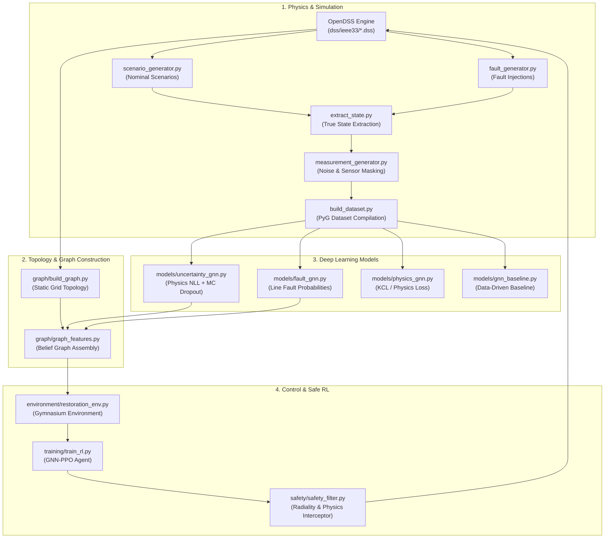

# Project File Directory & Reference Guide

**Project:** Uncertain Grid Restoration  
**Core Framework:** Physics-Informed Belief-State Reinforcement Learning for Distribution Grid Restoration under Severe Partial Observability.

---

## 1. High-Level Architecture & Pipeline Flow

The framework addresses power distribution grid restoration (IEEE-33 bus system) under partial observability and sensor failure. The overall file interaction lifecycle follows this pipeline:



---

## 2. Directory Tree Map

```text
uncertain_grid_restoration/
├── FILE_DIRECTORY.md                 # This comprehensive file index and guide
├── README.md                         # Project overview and high-level setup instructions
├── SYSTEM_ARCHITECTURE.md            # Detailed architectural & mathematical design doc
├── Evaluation_Plan.md                # 6-phase scientific evaluation & experiment plan
├── demo_pipeline.py                  # End-to-end executable demonstration of the pipeline
├── generate_scaled.py                # Batch generator for 50k & 100k simulation scenarios
├── setup_dss.py                      # OpenDSS configuration builder for IEEE-33 bus system
├── main.py                           # Project root entrypoint (stub)
│
├── dss/
│   └── ieee33/                       # OpenDSS physical grid definitions
│       ├── Master.dss                # Master configuration and circuit solver settings
│       ├── Lines.dss                 # Branch lines, lengths, impedances (R1, X1)
│       └── Loads.dss                 # Base active (kW) and reactive (kvar) load specs
│
├── simulator/                        # OpenDSS simulation, faults & sensor degradation
│   ├── run_dss.py                    # OpenDSS solver validation check script
│   ├── extract_state.py              # Omniscient ground-truth extractor (V, theta, I, P, Q)
│   ├── scenario_generator.py         # Healthy scenario generator (load scaling & DERs)
│   ├── fault_generator.py            # Fault injection generator (SLG, LL, 3P, HIF)
│   ├── measurement_generator.py      # Noise injector and random sensor masking simulator
│   └── build_dataset.py              # PyG tensor compiler (creates dataset_1k.pt)
│
├── graph/                            # Graph construction & belief representation
│   ├── build_graph.py                # Extracts PyG topology (edge_index, edge_attr) from OpenDSS
│   └── graph_features.py             # Fuses GNN estimates & faults into the central Belief Graph
│
├── models/                           # Deep Learning neural network architectures
│   ├── gnn_baseline.py               # Pure data-driven GATv2 baseline model
│   ├── physics_gnn.py                # Physics-informed GNN with KCL & voltage penalty losses
│   ├── uncertainty_gnn.py            # Gaussian NLL GNN with MC Dropout uncertainty decomposition
│   └── fault_gnn.py                  # FaultDetectorGNN and FaultLocatorGNN (edge readout)
│
├── safety/                           # Physics and topological constraint enforcement
│   └── safety_filter.py              # Interceptor checking radiality, loop prevention, voltage & thermal limits
│
├── environment/                      # Reinforcement Learning Gym environment
│   └── restoration_env.py            # Gymnasium environment integrating OpenDSS, GNNs, & Safety Filter
│
├── training/                         # Model training pipelines
│   ├── train_state.py                # Supervised training loop for state estimation GNNs
│   ├── train_fault.py                # Supervised training loop for fault localization GNN (stub)
│   └── train_rl.py                   # PPO training loop (Flat MLP vs Native GNN feature extractors)
│
├── evaluation/                       # Validation & benchmarking scripts
│   ├── evaluate_baseline.py          # Baseline GNN evaluation under varying sensor sparsity
│   ├── state_metrics.py              # Uncertainty GNN validation (RMSE, NLL, sigma, 95% CI coverage)
│   ├── fault_metrics.py              # Fault localization metrics evaluation (stub)
│   └── restoration_metrics.py        # Grid restoration performance metrics evaluation (stub)
│
├── experiments/                      # Research experiment execution scripts
│   └── exp6_fault_ambiguity.py       # Experiment 6: Controller safety under fault ambiguity cases
│
└── data/                             # Generated datasets & trained model weights
    ├── state_estimation/             # State estimation scenario pickles and compiled tensors
    │   ├── scenarios_1k.pkl          # 1,000 nominal state scenarios
    │   ├── scenarios_10k.pkl         # 10,000 nominal state scenarios
    │   ├── scenarios_50k.pkl         # 50,000 nominal state scenarios
    │   ├── scenarios_100k.pkl        # 100,000 nominal state scenarios
    │   └── dataset_1k.pt             # Compiled PyTorch Geometric tensor dataset
    ├── fault_localization/           # Fault scenario pickles
    │   └── fault_scenarios_1k.pkl    # 1,000 injected fault scenarios with ground-truth labels
    └── processed/                    # Trained model checkpoints
        ├── baseline_ppo_model.zip    # Pre-trained baseline PPO agent
        ├── ppo_flatten.zip           # PPO model trained with flattened feature extractor
        └── ppo_gnn.zip               # PPO model trained with native GraphGNNExtractor
```

---

## 3. Detailed File-by-File Breakdown

### 3.1. Root Files

#### `demo_pipeline.py`
- **Purpose:** Full end-to-end integration execution demo. It orchestrates a full cycle: loading the trained GNN-PPO agent, initializing the environment, injecting faults, generating noisy/masked sensor data, passing through the Uncertainty GNN and Fault GNN, building the Belief Graph, predicting a switching action, validating against the Safety Filter, and executing OpenDSS power flow.
- **Key Function:** `run_final_pipeline_demo()`
- **Inputs:** `data/processed/ppo_gnn.zip`, OpenDSS IEEE-33 models.
- **Outputs:** Console trace verifying all 8 pipeline execution steps.

#### `generate_scaled.py`
- **Purpose:** Batch script to generate large-scale datasets (50,000 and 100,000 scenarios) by calling `simulator.scenario_generator.generate_scenarios()`.
- **Inputs:** OpenDSS IEEE-33 base circuit.
- **Outputs:** `data/state_estimation/scenarios_50k.pkl`, `data/state_estimation/scenarios_100k.pkl`.

#### `setup_dss.py`
- **Purpose:** Generates the OpenDSS model files (`Master.dss`, `Lines.dss`, `Loads.dss`) for the IEEE-33 bus system from raw bus, line impedance, and load specifications.
- **Outputs:** Files in `dss/ieee33/`.

#### `main.py`
- **Purpose:** Entrypoint stub for CLI invocation or high-level application routing.

#### `README.md`
- **Purpose:** Project overview, architectural diagrams, mathematical loss formulation, reward structure, and quick-start instructions.

#### `SYSTEM_ARCHITECTURE.md`
- **Purpose:** Detailed theoretical and implementation guide covering simulator mechanics, GNN architectures, physics loss equations, MC dropout decomposition, belief graphs, and safety filter rules.

#### `Evaluation_Plan.md`
- **Purpose:** Formal scientific evaluation blueprint defining the 6 primary research experiments (Physics Regularization, Uncertainty Decomposition, Fault Diagnosis, Restoration Architectures, Sparsity Robustness, Controller Safety under Ambiguity, and Scaling).

---

### 3.2. OpenDSS Grid Models (`dss/ieee33/`)

#### `Master.dss`
- **Purpose:** OpenDSS master circuit script initializing the IEEE 33-bus system at 12.66 kV, setting frequency, defining the substation slack bus, and redirecting lines and loads.

#### `Lines.dss`
- **Purpose:** OpenDSS definitions for all 32 distribution lines connecting buses 1 through 33, specifying positive-sequence resistance (`r1`), reactance (`x1`), and line length.

#### `Loads.dss`
- **Purpose:** OpenDSS definitions for active power ($P$ in kW) and reactive power ($Q$ in kvar) customer demands attached to buses 2 through 33.

---

### 3.3. Simulation & Data Pipeline (`simulator/`)

#### `run_dss.py`
- **Purpose:** Sanity test script to verify that OpenDSS compiles, solves power flow, and converges on the IEEE-33 network.
- **Key Calls:** `dss.Solution.Solve()`, `dss.Solution.Converged()`, `dss.Circuit.AllBusMagPu()`.

#### `extract_state.py`
- **Purpose:** Extracts omniscient, noise-free physical ground-truth tensors from converged OpenDSS power flow solutions.
- **Key Function:** `extract_ground_truth()`
- **Extracted Fields:**
  - `voltage`: Per-unit magnitude and phase angle for all phases at every bus.
  - `angle`: Voltage phase angles in degrees.
  - `current`: Sending-end conductor current magnitudes for every branch line.
  - `power`: Active ($P$) and reactive ($Q$) power flows for every line.

#### `scenario_generator.py`
- **Purpose:** Generates diverse, healthy operational states by perturbing loads (uniform random 70%–130% scaling) and injecting Distributed Energy Resources (DERs: 3 solar PV plants and 2 wind generators with random generation multipliers).
- **Key Functions:** `add_ders()`, `generate_scenarios(num_scenarios, save_path)`
- **Outputs:** Pickled scenarios (e.g., `scenarios_1k.pkl`, `scenarios_10k.pkl`).

#### `fault_generator.py`
- **Purpose:** Injects physical faults into the grid and generates fault scenario datasets with ground-truth fault labels.
- **Key Functions:**
  - `apply_fault(bus_name, fault_type, r_fault)`: Injects Single-Line-to-Ground (SLG), Line-to-Line (LL), Three-Phase (3P), or High-Impedance Faults (HIF).
  - `generate_fault_scenarios(num_scenarios, save_path)`: Simulates grid under randomized faults.
- **Outputs:** `data/fault_localization/fault_scenarios_1k.pkl`.

#### `measurement_generator.py`
- **Purpose:** Simulates realistic field sensor conditions by corrupting ground-truth states with Gaussian measurement noise and applying random sensor dropout/masking.
- **Key Function:** `generate_measurements(true_state, missing_probability, v_std, p_std, q_std, i_std)`
- **Behavior:** Missing sensors are zeroed out and accompanied by a boolean indicator mask (`mask=0` for missing, `mask=1` for observable). The substation source bus voltage sensor is always kept available.

#### `build_dataset.py`
- **Purpose:** Compiles raw scenario dictionaries and OpenDSS topological data into ready-to-train PyTorch Geometric graph tensors.
- **Key Function:** `build_dataset(scenarios_file, output_file)`
- **Features Formatted:**
  - Node Features $X \in \mathbb{R}^{N \times 4}$: $[V_{\text{meas}, 1}, V_{\text{meas}, 2}, V_{\text{meas}, 3}, V_{\text{mask}}]$
  - Edge Features $E \in \mathbb{R}^{2E \times 12}$: $[R, X, P_{\text{meas}}, Q_{\text{meas}}, I_{\text{meas}}, \text{mask}]$
  - Target Labels: $V_{\text{true}}, \theta_{\text{true}}, I_{\text{true}}$
- **Outputs:** `data/state_estimation/dataset_1k.pt`.

#### `export_to_csv.py`
- **Purpose:** Converts all `.pkl` and `.pt` datasets into tabular `.csv` files for spreadsheet inspection, Pandas/R analysis, and external verification.
- **Key Functions:** `export_scenarios_pkl_to_csv()`, `export_pt_dataset_to_csv()`, `export_all()`
- **Outputs:** Tabular CSV files for buses, lines, graph nodes, and edges across all scenario sizes (1k, 10k, 50k, 100k).

---

### 3.4. Graph Construction & Feature Assembly (`graph/`)

#### `build_graph.py`
- **Purpose:** Translates the OpenDSS physical circuit into a PyTorch Geometric bidirectional graph structure.
- **Key Function:** `build_topology()`
- **Returns:**
  - `edge_index`: $2 \times 2E$ tensor of source and target bus indices.
  - `edge_attr`: Static branch resistance $R$ and reactance $X$.
  - `bus_to_idx` / `idx_to_bus`: Bidirectional mappings between OpenDSS bus names and node tensor indices.

#### `graph_features.py`
- **Purpose:** Constructs the central **Belief Graph** Markov state representation consumed by the RL restoration agent.
- **Key Function:** `build_belief_graph(estimated_state, fault_probabilities, static_topology, current_switches, raw_inputs)`
- **Feature Schema:**
  - **Node Features ($[N, 8]$):** $[\hat{V}, \hat{\theta}, \sigma_V, \sigma_\theta, P_{\text{load}}, Q_{\text{load}}, P_{\text{gen}}, \text{sensor\_mask}]$
  - **Edge Features ($[E, 6]$):** $[R, X, \hat{I}, I_{\text{max}}, \text{switch\_status}, P(\text{fault})]$

---

### 3.5. Neural Network Architectures (`models/`)

#### `gnn_baseline.py`
- **Purpose:** Standard data-driven Graph Attention Network (GATv2) baseline estimating $V$, $\theta$, and $I$ without physics loss regularizers.
- **Key Class:** `BaselineGNN(node_in_dim, edge_in_dim, hidden_dim)`
- **Layers:** Node projection Linear layer, 3 `GATv2Conv` layers with edge attribute processing, node MLP (outputs $V, \theta$), and edge MLP (outputs $I$).

#### `physics_gnn.py`
- **Purpose:** Physics-Informed GNN enforcing physical laws during training.
- **Key Classes:**
  - `PhysicsGNN`: GATv2 architecture predicting $\hat{V}, \hat{\theta}, \hat{I}$.
  - `PhysicsLoss`: Multi-objective loss function combining:
    $$L = L_{\text{data}} + \lambda_1 L_{\text{KCL}} + \lambda_2 L_{\text{Power}} + \lambda_3 L_{\text{Voltage}}$$
    - $L_{\text{KCL}}$: Penalizes Kirchhoff Current Law nodal mismatch ($\sum I_{\text{in}} - \sum I_{\text{out}} \ne 0$).
    - $L_{\text{Voltage}}$: Penalizes predicted voltages outside safe bounds ($[0.95, 1.05]$ pu).
    - $L_{\text{Power}}$: Penalizes power balance residuals ($P_{\text{loss}} - \sum I^2 R \ne 0$).

#### `uncertainty_gnn.py`
- **Purpose:** Uncertainty-aware GNN outputting predictive distributions $(\mu, \sigma)$ trained via Gaussian Negative Log-Likelihood (NLL), equipped with Monte Carlo Dropout for uncertainty decomposition.
- **Key Class:** `UncertaintyGNN`
- **Key Methods:**
  - `forward(x, edge_index, edge_attr)`: Predicts $V_{\mu}, V_{\sigma}, \theta_{\mu}, \theta_{\sigma}, I_{\mu}, I_{\sigma}$ with Softplus activation ensuring strictly positive standard deviations and a sensor residual bypass mechanism.
  - `mc_dropout_predict(x, edge_index, edge_attr, num_samples)`: Performs $N$ stochastic forward passes with active dropout to decompose total uncertainty into:
    - **Aleatoric Uncertainty:** $\sigma^2_{\text{aleatoric}} = \frac{1}{N}\sum \sigma_i^2$ (sensor/measurement noise).
    - **Epistemic Uncertainty:** $\sigma^2_{\text{epistemic}} = \text{Var}(\mu_1, \dots, \mu_N)$ (model ignorance in unobserved or OOD regions).

#### `fault_gnn.py`
- **Purpose:** Probabilistic fault detection and line-by-line localization models utilizing physics and measurement residuals.
- **Key Classes & Functions:**
  - `FaultDetectorGNN`: Global graph readout GNN predicting grid-level fault probability $P(\text{fault}) \in [0, 1]$.
  - `FaultLocatorGNN`: Edge readout GNN computing per-line fault probability $P(\text{fault}_{\text{line } i}) \in [0, 1]$ from concatenated endpoint node embeddings and edge residuals.
  - `compute_residuals(...)`: Computes measurement residuals ($V_{\text{meas}} - \hat{V}$, $I_{\text{meas}} - \hat{I}$) and KCL divergence mismatch vectors.

---

### 3.6. Safety Interceptor (`safety/`)

#### `safety_filter.py`
- **Purpose:** Real-time physics and topological constraint validator that intercepts proposed RL switching actions before and after trial execution, preventing physical damage.
- **Key Class:** `PhysicsSafetyFilter(lines)`
- **Key Methods:**
  - `check_radiality(proposed_switches)`: Evaluates network topology via `networkx` before running power flow. Rejects actions causing closed loops (`nx.find_cycle`) or isolated de-energized islands (`nx.is_connected`).
  - `check_physics()`: Evaluates grid states after a trial power flow. Rejects actions causing solver non-convergence, voltage violations ($V < 0.95$ or $V > 1.05$ pu on energized buses), or thermal overcurrent violations ($I > I_{\text{max}}$).

---

### 3.7. Reinforcement Learning Environment (`environment/`)

#### `restoration_env.py`
- **Purpose:** Gymnasium-compliant reinforcement learning environment encapsulating OpenDSS, sensor degradation, GNN state inference, the Safety Filter, and multi-objective physics rewards.
- **Key Class:** `RestorationEnv(gym.Env)`
- **Dynamics:**
  - **Action Space:** Discrete space $|\mathcal{A}| = N_{\text{switches}} + 1$. Action 0 = No-Operation, Action $k$ = Toggle Switch $k$.
  - **Observation Space:** Dictionary containing `node_features` ($[N, 8]$), `edge_features` ($[E, 6]$), and `edge_index`.
  - **Step Lifecycle:** Proposes switch toggle $\to$ evaluates `check_radiality` $\to$ executes trial OpenDSS solve $\to$ evaluates `check_physics` $\to$ commits state if safe or rolls back if rejected.
  - **Reward Function:**
    $$R = 10 \cdot R_{\text{load}} - 1.0 \cdot R_{\text{loss}} - 0.1 \cdot R_{\text{switch}} - 20 \cdot R_{\text{violation}}$$

---

### 3.8. Training Pipelines (`training/`)

#### `train_state.py`
- **Purpose:** Supervised training script for the State Estimation GNN using `dataset_1k.pt`.
- **Key Features:** Custom disjoint graph batching `collate_fn`, 80/20 train/validation split, Adam optimization, gradient clipping, and multi-target MSE evaluation.

#### `train_fault.py`
- **Purpose:** Dedicated training script for `FaultLocatorGNN` on `fault_scenarios_1k.pkl` using binary cross-entropy loss over line fault labels (currently stub).

#### `train_rl.py`
- **Purpose:** Trains the restoration RL agent using Stable-Baselines3 PPO, comparing flat and graph-native policy feature extractors.
- **Key Classes & Functions:**
  - `GraphFlattenExtractor`: Flattens node and edge features into a 1D vector processed by an MLP.
  - `GraphGNNExtractor`: Custom SB3 feature extractor performing native `GATv2Conv` message passing directly on the Belief Graph before actor-critic heads.
  - `compare_models()`: Trains and saves both `ppo_flatten` and `ppo_gnn` models.

---

### 3.9. Evaluation & Benchmarking (`evaluation/` & `experiments/`)

#### `evaluate_baseline.py`
- **Purpose:** Evaluates the baseline GNN under varying sensor missing rates (e.g., 20%, 50%), training on 800 scenarios and testing on 200 scenarios with feature scaling.

#### `state_metrics.py`
- **Purpose:** Rigorous validation script for the Uncertainty GNN under dynamic sensor masking (10% to 90% missing).
- **Key Function:** `validate_uncertainty_dynamic()`
- **Reported Metrics:** Compares observable vs. missing sensor locations for Voltage RMSE, Negative Log-Likelihood (NLL), Predicted $\sigma$, and 95% Confidence Interval Coverage.

#### `fault_metrics.py`
- **Purpose:** Evaluation suite for fault localization accuracy (Top-1, Top-3, Brier calibration score) across fault types (stub).

#### `restoration_metrics.py`
- **Purpose:** Benchmarking suite for grid restoration KPIs (percentage load restored, switching steps, constraint violations) against baseline controllers (stub).

#### `exp6_fault_ambiguity.py`
- **Purpose:** Executes Experiment 6 from `Evaluation_Plan.md`: evaluates the trained PPO agent and safety filter under three distinct fault probability ambiguity regimes:
  - **Case A (High Confidence):** Sharp fault distribution ($P = [0.95, 0.03, 0.02]$).
  - **Case B (Medium Ambiguity):** Moderately spread probabilities ($P = [0.60, 0.25, 0.15]$).
  - **Case C (High Ambiguity):** High uncertainty distribution ($P = [0.40, 0.35, 0.25]$).

---

### 3.10. Data Artifacts & Saved Models (`data/`)

| File Path | Format | Size / Description | Usage |
|:---|:---:|:---:|:---|
| `data/state_estimation/scenarios_1k.pkl` | Pickle | 1,000 nominal OpenDSS states | Dataset compilation & baseline evaluation |
| `data/state_estimation/scenarios_10k.pkl` | Pickle | 10,000 nominal OpenDSS states | Scaled model training |
| `data/state_estimation/scenarios_50k.pkl` | Pickle | 50,000 nominal OpenDSS states | High-capacity training |
| `data/state_estimation/scenarios_100k.pkl`| Pickle | 100,000 nominal OpenDSS states| Full asymptotic training |
| `data/state_estimation/dataset_1k.pt` | PyTorch Binary | Compiled PyG graphs | Supervised training in `train_state.py` |
| `data/fault_localization/fault_scenarios_1k.pkl` | Pickle | 1,000 labeled fault states | Training `FaultLocatorGNN` |
| `data/state_estimation/*.csv` | CSV | Tabular exports of buses, lines, nodes, and edges (1k to 100k) | Spreadsheet analysis & external tools |
| `data/fault_localization/*.csv` | CSV | Tabular exports of fault metadata, buses, and lines | Spreadsheet analysis & external tools |
| `data/processed/baseline_ppo_model.zip` | SB3 Zip | Pretrained PPO model | Baseline restoration comparison |
| `data/processed/ppo_flatten.zip` | SB3 Zip | Trained flat PPO model | Architectural comparison |
| `data/processed/ppo_gnn.zip` | SB3 Zip | Trained Graph-PPO model | Production model for `demo_pipeline.py` |

---

## 4. Quick Reference Execution Guide

| Objective | Command | Primary Script |
|:---|:---|:---|
| **Verify OpenDSS Physics** | `python simulator/run_dss.py` | `run_dss.py` |
| **Generate Scenarios** | `python simulator/scenario_generator.py` | `scenario_generator.py` |
| **Generate Fault Scenarios** | `python simulator/fault_generator.py` | `fault_generator.py` |
| **Compile PyG Tensors** | `python simulator/build_dataset.py` | `build_dataset.py` |
| **Export All Datasets to CSV** | `python simulator/export_to_csv.py` | `export_to_csv.py` |
| **Train State Estimator** | `python training/train_state.py` | `train_state.py` |
| **Evaluate Uncertainty Metrics** | `python evaluation/state_metrics.py` | `state_metrics.py` |
| **Train Restoration PPO** | `python training/train_rl.py` | `train_rl.py` |
| **Run Ambiguity Experiment** | `python experiments/exp6_fault_ambiguity.py` | `exp6_fault_ambiguity.py` |
| **Run Full End-to-End Demo** | `python demo_pipeline.py` | `demo_pipeline.py` |
